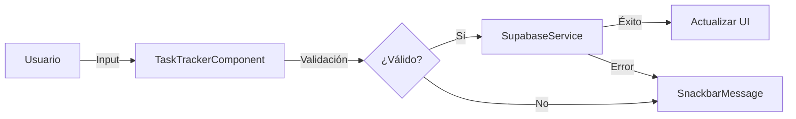

# 🛠️ Task Tracker - Documentación Técnica

## 🏗️ Arquitectura del Sistema

### Frontend (Angular 19.5)

#### Componentes Principales
1. **TaskTrackerComponent**
   ```typescript
   @Component({
     selector: 'app-task-tracker',
     standalone: true
   })
   ```
   - Gestión del estado de tareas
   - Validaciones en tiempo real
   - Manejo de eventos de usuario
   - Integración con Supabase

2. **SnackbarMessageComponent**
   - Notificaciones del sistema
   - Feedback de acciones
   - Mensajes de error/éxito

### Backend (Supabase)

#### Estructura de la Base de Datos
```sql
CREATE TABLE tasks (
  id UUID DEFAULT uuid_generate_v4() PRIMARY KEY,
  description TEXT NOT NULL,
  completed BOOLEAN DEFAULT FALSE,
  created_at TIMESTAMP WITH TIME ZONE DEFAULT TIMEZONE('utc'::text, NOW())
);
```

#### Índices y Restricciones
```sql
CREATE UNIQUE INDEX idx_task_description ON tasks (LOWER(description));
```

## 🔄 Flujo de Datos

### 1. Creación de Tarea


### 2. Sincronización
- Suscripción en tiempo real a cambios
- Caché local con localStorage
- Manejo de conflictos

## 🛡️ Seguridad

### Validaciones
1. **Frontend**
   ```typescript
   private validateTaskDescription(description: string): boolean {
     // Validación de longitud
     if (description.length < 3) return false;
     
     // Validación de duplicados
     if (this.taskExists(description)) return false;
     
     return true;
   }
   ```

2. **Backend**
   - Políticas RLS de Supabase
   - Validación de tipos
   - Sanitización de entrada

## 🎨 UI/UX

### Componentes Material
```typescript
imports: [
  MatInputModule,
  MatButtonModule,
  MatCardModule,
  MatCheckboxModule,
  MatSnackBarModule
]
```

### Estilos SCSS
```scss
.task-card {
  @include mat-elevation(2);
  transition: transform 0.2s;
  
  &:hover {
    @include mat-elevation(8);
    transform: translateY(-2px);
  }
}
```

## 🔧 Configuración del Proyecto

### Angular
```json
{
  "projects": {
    "task-tracker": {
      "architect": {
        "build": {
          "builder": "@angular-devkit/build-angular:application",
          "options": {
            "outputPath": "dist/task-tracker",
            "index": "src/index.html",
            "browser": "src/main.ts"
          }
        }
      }
    }
  }
}
```

### Supabase
```typescript
const supabaseConfig = {
  url: process.env['SUPABASE_URL'] || '',
  key: process.env['SUPABASE_KEY'] || '',
  options: {
    realtime: true,
    persistSession: true
  }
};
```

## 📊 Rendimiento

### Optimizaciones
1. **Lazy Loading**
   ```typescript
   const routes: Routes = [{
     path: 'tasks',
     loadComponent: () => import('./task-tracker/task-tracker.component')
   }];
   ```

2. **Change Detection**
   ```typescript
   @Component({
     changeDetection: ChangeDetectionStrategy.OnPush
   })
   ```

3. **Memoria**
   - Desuscripción automática de observables
   - Limpieza de recursos en ngOnDestroy
   - Gestión eficiente del estado

## 🧪 Testing

### Unit Tests
```typescript
describe('TaskTrackerComponent', () => {
  it('should validate task description', () => {
    const component = new TaskTrackerComponent();
    expect(component.validateTaskDescription('')).toBeFalsy();
    expect(component.validateTaskDescription('abc')).toBeTruthy();
  });
});
```

### E2E Tests
```typescript
describe('Task Creation', () => {
  it('should create new task', () => {
    cy.visit('/');
    cy.get('[data-test="task-input"]').type('Nueva tarea');
    cy.get('[data-test="add-button"]').click();
    cy.contains('Nueva tarea').should('exist');
  });
});
```

## 📱 PWA Features

### Service Worker
```typescript
@NgModule({
  imports: [
    ServiceWorkerModule.register('ngsw-worker.js', {
      enabled: !isDevMode(),
      registrationStrategy: 'registerWhenStable:30000'
    })
  ]
})
```

### Manifest
```json
{
  "name": "Task Tracker",
  "short_name": "Tasks",
  "theme_color": "#1976d2",
  "background_color": "#fafafa",
  "display": "standalone",
  "scope": "./",
  "start_url": "./"
}
```

## 🔍 Monitoreo

### Error Handling
```typescript
@Injectable()
export class GlobalErrorHandler implements ErrorHandler {
  handleError(error: Error) {
    console.error('An error occurred:', error);
    // Enviar a servicio de monitoreo
  }
}
```

### Analytics
- Seguimiento de uso
- Métricas de rendimiento
- Patrones de usuario

## 📦 Dependencias Principales

```json
{
  "dependencies": {
    "@angular/core": "^19.5.0",
    "@angular/material": "^19.5.0",
    "@supabase/supabase-js": "^2.39.0",
    "rxjs": "^7.8.0"
  }
}
```

## 🚀 CI/CD

### GitHub Actions
```yaml
name: CI
on: [push]
jobs:
  build:
    runs-on: ubuntu-latest
    steps:
      - uses: actions/checkout@v2
      - name: Install
        run: npm ci
      - name: Test
        run: npm test
      - name: Build
        run: npm run build
```

## 📚 Recursos Adicionales

### API Referencias
- [Angular API](https://angular.dev/api)
- [Supabase API](https://supabase.com/docs/reference)
- [RxJS API](https://rxjs.dev/api)

### Herramientas de Desarrollo
- VS Code con Angular Language Service
- Angular DevTools
- Supabase CLI

## 🤝 Guía de Contribución

### Estándares de Código
- ESLint configuración
- Prettier para formato
- Convenciones de Angular

### Proceso de Review
1. Fork y Clone
2. Desarrollo en rama feature
3. Tests y linting
4. Pull Request
5. Code Review

## 📄 Licencia
MIT License - ver LICENSE.md

---

📝 **Nota para Desarrolladores**: 
Este documento está en constante evolución. Si encuentras algo que podría mejorarse, ¡no dudes en contribuir!
